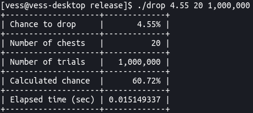

# drop



## Help with drop

```
usage:

drop chance: f32 = (0.0, 100.0)
chests: u32 = (0, 4,294,967,295]
trials: u32 = (0, 4,294,967,295]

drop <drop chance> <chests> <trials>
	Simulate the chance out of N trials to get at least 1 item from N chests if the item has N drop chance.

Example usage:
	drop 4.55 20 1,000,000
```

## Running the program

Required tools installed on the system path:
- cargo and a rust toolchain installed
- git

```
git clone https://github.com/vess-dev/drop
cd drop
cargo run
```

## Compiling a large test build

Required tools installed on the system path:
- cargo and a rust toolchain installed
- git

```
git clone https://github.com/vess-dev/drop
cd drop
cargo build --release
target/release/drop
```

## Compiling a small distributed build

Required tools installed on the system path:
- cargo and a rust toolchain installed
- git
- strip
- sstrip (from elfkickers)
- upx

```
git clone https://github.com/vess-dev/drop
cd drop
chmod +x build.sh
./build.sh
target/release/drop
```

## Compiling a Windows build

Instructions can be found commented in `build.sh`.

## License

https://creativecommons.org/licenses/by/4.0/
